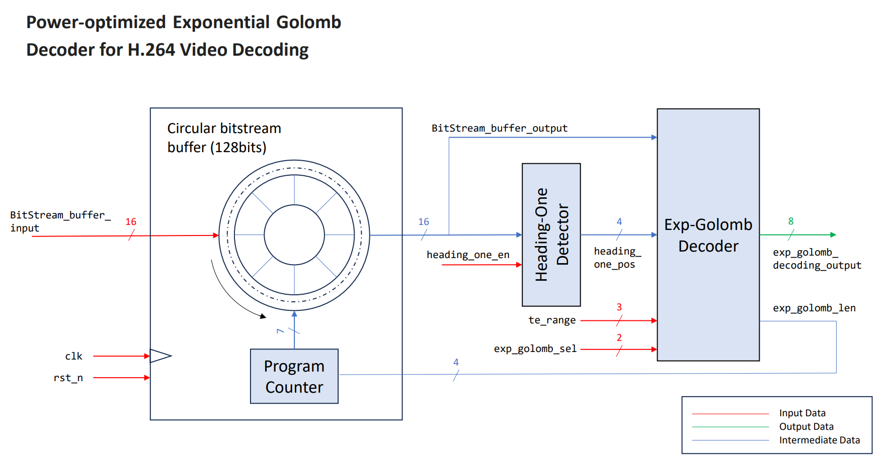

# Proposal Title: Power-optimized Exponential Golomb Decoder for H.264 Video Decoding

  

**Introducing Our Team & Design**

As a team of passionate undergraduates interested in silicon-proven ASIC design, we are thrilled to participate in the UNIC-CASS (Universalization of IC Design from CASS) program organized by IEEE Circuits and Systems Society (CASS) to improve the know-how and accessibility to IC Design technologies for enthusiasts and design communities worldwide in low-to-middle-income and/or low-opportunity countries. Our team's entry introduces a Power-optimized Exponential Golomb Decoder for H.264 Video Decoding to improve H.264 variable length decoding performance by implementing it on hardware. This project was inspired by the ever-increasing implementation of camera and object detection algorithms across various industries. As the demand for real-time video processing continues to surge, the need for seamless and efficient video decoding has become paramount.

We would also like to appreciate Xu Ke for making the H.264/AVC Baseline Decoder, aka "nova" open-source on https://opencores.org/projects/nova. Our project's base architecture is referenced from "nova", of which we identified the exponential golomb decoder, heading one detector, program counter, and cyclical data buffer as necessary components to make our standalone Exponential Golomb Decoder design work. We will be reusing most of the ready-made "nova" RTL and make changes as necessary as our proposal focuses more on the RTL2GDSII flow of Digital IC Design. 

**Our Design Inspiration & Rationale**

In recent years, the application of camera and object detection algorithms has witnessed a remarkable surge, transforming industries such as surveillance, autonomous vehicles, robotics, and augmented reality. These algorithms have proven to be instrumental in improving safety, enhancing user experiences, and optimizing decision-making processes. However, one significant bottleneck has emerged in this revolution – the speed of video decoding. To enable real-time video processing, it is essential to decode video streams rapidly and efficiently. As high-resolution video data demands immense processing power and bandwidth, traditional decoding methods struggle to keep up with the demands of modern applications. The need for a robust, open-source H.264 video decoder that can seamlessly integrate into various platforms has never been more critical. Driven by the motivation to overcome the challenges faced by camera and object detection algorithms, our team has embarked on a journey to develop an open-source H.264 video decoder that ensures smooth and real-time video decoding, regardless of the platform being used. However, due to design area constraints, we changed focus to work on developing the Power-optimized Exponential Golomb Decoder for H.264 Video Decoding, which is an essential component of the variable-length decoding in H.264 standard.

**The Power of Open-Source Sharing:**

At the core of our team's mission lies the spirit of open-source sharing. Through our project we hope to foster a vibrant ecosystem of developers, researchers, and enthusiasts who can incorporate our designs into their projects. Embracing the power of collective knowledge, we believe this project will lead to continuous enhancements, optimizations, and adaptation to a broad range of applications.

**Key Objectives of the Project:**

1. Implement an Power-optimized Exponential Golomb Decoder for H.264 Video Decoding that functions on real silicon.
2. Achieving best PPA (Power, Performance, Area) utilizing SkyWater's SKY130 PDK.
3. Foster a collaborative and supportive community to encourage knowledge sharing, issue resolution, and future advancements.
4. Empower industries and applications reliant on camera and object detection algorithms to achieve superior video playback performance, enabling new possibilities and applications.

**Block Diagram**

**Design Spec Estimation**
| Specifications | Number     |
| :------------- | :--------: |
| Inputs         | 24         |
| Outputs        | 8          |
| Gate Count     | ~6000      |
| Scan Chain     | undecided  |

**Conclusion:**

As a team committed to enhancing video playback performance through this Power-optimized Exponential Golomb Decoder for H.264 Video Decoding project, our efforts stem from a deep understanding of the challenges faced by camera and object detection algorithms. By delivering an open-source, high-performance solution, we aspire to empower developers worldwide, paving the way for real-time video processing in an array of applications.

# Caravel User Project
| :exclamation: Important Note            |
|-----------------------------------------|

## Please fill in your project documentation in this README.md file 

Refer to [README](docs/source/index.rst#section-quickstart) for a quickstart of how to use caravel_user_project

Refer to [README](docs/source/index.rst) for this sample project documentation. 

Refer to the following [readthedocs](https://caravel-sim-infrastructure.readthedocs.io/en/latest/index.html) for how to add cocotb tests to your project. 